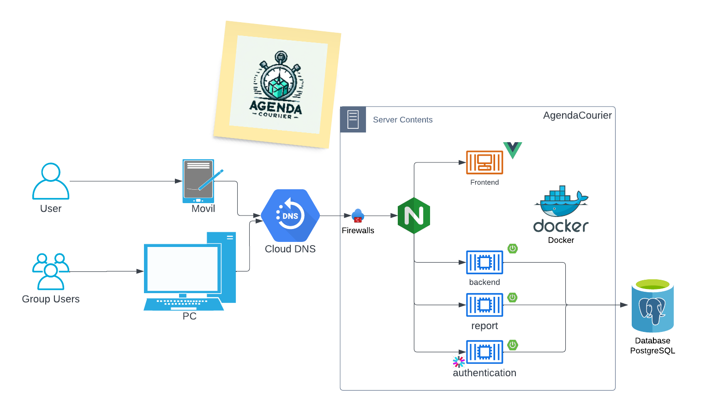

# sistemasDistribuidos

## Diagrama de arquitectura



## Componentes del diagrama de arquitectura

1. Firewalls.
2. Nginx load balancer.
3. Imagen con vue js para el front.
4. Backend App.
5. Backend Report.
6. Backend Authenticacion.
7. Base de datos postgress

Asigancion de imagenes a los componentes:

|Aplicacion|imagen|
|---|---|
|Firewalls|api-firewall:latest|
|Nginx load balancer|nginx:latest|
|Imagen con vue js para el front|nginx:latest|
|Backend App|johanc29/docker-mitocode-microservice:28|
|Backend Report|johanc29/docker-mitocode-microservice:28|
|Backend Authenticacion|johanc29/docker-mitocode-microservice:28|
|Base de datos postgress|postgres:latest|

## Configuracion archivo .tf

main.tf

## Instalacion y aplicacion

```sh
terraform validate

terraform apply
```

### Referencias

1. [docker provider](https://registry.terraform.io/providers/kreuzwerker/docker/latest/docs/resources/container#nestedblock--volumes)
